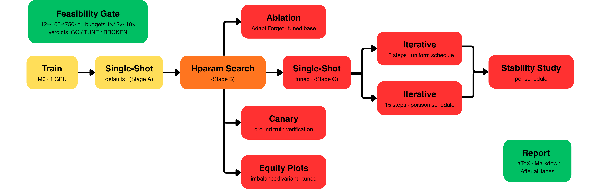

# Machine Unlearning Methods & Evaluation Framework
## Identity-Level Unlearning on SFHQ-InstantID

Dual-head ResNet-18 framework for evaluating machine unlearning methods on synthetic
facial identity data. Models a realistic GDPR "right to be forgotten" scenario:
750 synthetic identity clusters, 15 sequential deletion steps, 5 identities per step.

---

## Task

**Primary**: 750-class identity classification (MUFAC-aligned, Choi & Na 2023).
**Secondary**: 4-class age-group classification (Handover-aligned, from proxy labels).
**Unlearning target**: The model must not recognise the deleted person (identity head)
nor their age group (age head) — a dual test of identity-level and attribute-level
forgetting.

### Architecture

```
ResNet-18 backbone (ImageNet-pretrained, 224×224)
  → AdaptiveAvgPool2d → 512-d features
  → fc_identity : 512 → 750   (primary task)
  → fc_age      : 512 →   4   (secondary task)
```

**Training**: Joint loss `L = L_id + λ · L_age` (default λ = 0.5). AMP on CUDA.

### Dataset

| Property | Balanced | Imbalanced |
|----------|----------|------------|
| Identities | 750 | 750 |
| Images/ID | 90 (72 train / 18 holdout) | 82:41:16 train gradient (5:1) |
| Total images | 67,500 | ~36,075 |
| Split | 675 retain / 75 forget | Same IDs, pruned |
| Forget protocol | 15 steps × 5 IDs (uniform + seeded-Poisson schedules) | Single-shot (no time axis — the popularity gradient IS the axis) |

### Schema

**v1.1 (750-id redesign)** — both artifacts carry 12 columns but different
column sets.  Identity classes, forget-step count and per-step sizes are
inferred from the CSV at runtime (no hardcoding — see `dataset.py`).

Balanced — `dataset.csv` / `dataset.parquet` (12 columns):

| Column | Type | Notes |
|--------|------|-------|
| `image_path` | string | relative path (resolved against CSV dir, then data root) |
| `identity_id` | int | primary key (renamed from `clusterid`) |
| `age_group` | int (0–3) | age-label for the age head |
| `age` | int | raw age estimate |
| `gender` | int (0/1) | confound control / fairness analysis |
| `split` | string | `retain` / `forget` (no `test` — every identity is one or the other) |
| `forget_step` | int | uniform schedule, −1 = retain (5 ids/step × 15) |
| `forget_step_poisson` | int | seeded-Poisson schedule (λ=5, variable batches), −1 = retain |
| `image_subset` | string | `train` / `holdout` (per-identity split) |
| `arcface_similarity` | float | within-identity outlier confound control |
| `laplacian_variance` | float | image-quality confound |
| `detection_confidence` | float | alignment quality |

Imbalanced — `dataset_imbalanced.csv` / `.parquet` (12 columns): same minus
the two schedule columns, plus `popularity_bin` (high/medium/low) +
`images_per_identity` (82/41/16).  The imbalanced artifact has **no time
axis** — its experimental axis is the popularity gradient.

File format (CSV or Parquet) is auto-detected from the extension.

---

## Pipeline Stages



*Overall experimental design. **Green** stages bracket the run: the initial
feasibility gate (before) and the final report (after). **Yellow** stages run at
default configurations (train, single-shot defaults). **Orange** is the
hyperparameter search. **Red** stages run at tuned configurations (tuned
single-shot, ablation, canary, equity plots, both iterative schedules, and the
stability study). The tuned lanes branch from the hyperparameter stage; both
iterative schedules feed the stability study; every lane closes on the report.*

Stage-by-stage:

- **Feasibility gate** *(green, runs first)* — multi-scale (12-id + 100-id
  subsamples, plus the 750-id column from the hparam grids), budget sweep
  1×/3×/10× per method. Verdicts: `GO` / `TUNE` / `TUNE(retain-collapse)` /
  `BROKEN`. It trains its own small model, so it has no dependency on the
  full-scale train job — but its verdicts shape how every downstream result is
  read: *is this method's full-scale failure a config problem (responds to
  budget) or structural (no response at any scale)?*
- **train** *(yellow, defaults)* — dual-head ResNet-18 on the full dataset
  (per-seed checkpoints).
- **single_shot (defaults)** *(yellow)* — every method at its YAML-documented
  default: the out-of-the-box behaviour a practitioner would get.
- **hparam** *(orange)* — one grid-search job per method (parallel); writes
  `{method}_best_config.json` ranked by the v2 erasure-conditioned UF score
  (§5.1, with the hard rejection gate §6.1).
- **single_shot_best (tuned)** *(red)* — every method at its UF-best config:
  the method's ceiling. The default-vs-tuned contrast is the config-fragility
  result.
- **iterative → stability** *(red)* — 15-step sequential deletion
  (5 identities/step), cumulative mode; the uniform and Poisson schedule lanes
  run in parallel and both feed the stability study (16 publication-quality
  plots).
- **ablation** *(red)* — AdaptiForget component ablation at its tuned base
  (early-stop, adaptive-λ, mask-refresh, KL-distil, masking).
- **canary** *(red)* — Tier-4 ground-truth deletion proof: identities tagged
  in training, gap between tagged/original confidence after unlearning.
- **(imbalanced) equity plots** *(red)* — per-identity equity across the
  popularity bins, using the tuned single-shot results.
- **report** *(green, runs last)* — the human-readable summary (Markdown +
  LaTeX + CSV flat tables) for both datasets, waiting on every lane above.

Config routing (design intent: **only the original single-shot uses default
configs — everything downstream runs with the HP-tuned best configs**).

### Slurm job dependency graph

**Balanced lane** (iterative + stability are the two schedule lanes, uniform
and Poisson, run in parallel):

```
                                  ┌──> canary ────────────────────────────────────────────────────────┐
                                  │                                                                   │
                                  ├──> ablation ──────────────────────────────────────────────────────┤
                                  │                                                                   │
[ train ] ──> single_shot ──> hparam ×9 ──> single_shot_best ──┐                                      │
                                  │                            │                                      │
                                  └──> iterative ×2 ───────────┴──> stability ×2 ─────────────────────┴──> [ report ]

[ feasibility ] (parallel, no dependency)────────────────────────────────────────────────────────────────> [ report ]
```

**Imbalanced lane** (replaces the schedule lanes — its axis is the popularity
gradient, not time):

```
                                  ┌──> canary ──────────────────────────────────────────────────────────────────────────┐
                                  │                                                                                     │
                                  ├──> ablation ────────────────────────────────────────────────────────────────────────┤
                                  │                                                                                     │
[ train ] ──> single_shot ──> hparam ×9 ──> single_shot_best ────┬──> equity plots ─────────────────────────────────────┤
                                                                 │                                                      │
                                                                 ├──> per-bin oracles (B) ────┐                         │
                                                                 │                            │                         │
                                                                 └──> Protocol C select ──────┴──> budget sweep (C)─────┴──> [ report ]

[ feasibility ] (parallel, no dependency) ─────────────────────────────────────────────────────────────────────────────────> [ report ]
```

*Dependency semantics (from `hpc_full_pipeline.sh`): `single_shot` and
`hparam` both wait on `train` (parallel); `single_shot_best`, `ablation` and
`canary` wait on all hparam jobs; `iterative` waits on `single_shot` + `hparam`
(so both schedule lanes use tuned configs with the default run as evidence);
`stability` waits on its `iterative` lane + `single_shot_best`; the report
waits on every lane.*

| Stage | Script | Config used | Parallel? |
|-------|--------|-------------|-----------|
| Train | `train.py` | Train original model M on retain+forget (train subset) | — |
| Single-shot | `single_shot.py` | **DEFAULT configs** (the baseline) | After train |
| HP search | `hparam_search.py` | Grid/random search, UF-score ranking | Parallel with single-shot |
| Single-shot-best | `single_shot.py --best_configs` | **Tuned** configs (headline results) | After all HP jobs |
| Feasibility gate | `feasibility_study.py` | Multi-scale (12-id + 100-id) budget sweep 1×/3×/10× → verdicts GO / TUNE / TUNE(retain-collapse) / BROKEN — wired into the pipeline; also runs standalone | Parallel (no train dep) |
| Equity plots | `imbalanced_plots.py` | 6 per-bin equity plots + Kruskal-Wallis (imbalanced only) | **After single_shot_best (tuned)** |
| Iterative | `iterative.py` | Schedule protocol (uniform 5×15, or Poisson) — **cumulative mode** (model never reset; effects compound); fresh mode (restart from M₀ per step) implemented but **not part of the canonical run** — future work; re-emergence, `--order_seed` for order-stability | **After single_shot + hparam** |
| Stability | `stability.py` | 16 publication-quality plots | After its iterative lane + single_shot_best |
| Ablation | `ablation_study.py` | AdaptiForget component ablation (6 variants, one component disabled each) | **After hparam; tuned AdaptiForget base** |
| Canary | `canary.py` | Pixel-level ground-truth deletion proof | **After hparam; tuned unlearning** |
| Report | `report.py` | LaTeX/Markdown synthesis of all results | After every lane |

## Quick Start

```bash
# Install dependencies (on Aire: install torch cu124 wheels first, see HPC CookBook)
pip install -e .

# Train original model
python src/train.py --csv ../bench/metadata/dataset.csv --save_dir results/checkpoints

# Single-shot evaluation (smoke test)
python src/single_shot.py --csv ../bench/metadata/dataset.csv \
    --model results/checkpoints/original_model_best.pt \
    --scale 0.1 --skip_retrain --methods ga ft ng_plus

# Full single-shot
python src/single_shot.py --csv ../bench/metadata/dataset.csv \
    --model results/checkpoints/original_model_best.pt

# Iterative protocol (15 steps)
python src/iterative.py --csv ../bench/metadata/dataset.csv \
    --model results/checkpoints/original_model_best.pt \
    --methods ng_plus msg_kd adaptiforget

# Stability plots (16; per-identity + demographic plots read the TOP-LEVEL
# single-shot CSVs — run_single_shot_multi_seed aggregates them across seeds)
python src/stability.py --combined results/iterative/iterative_combined_aggregated.csv \
    --per_id_csv results/single_shot/single_shot_per_identity.csv \
    --demog_csv results/single_shot/single_shot_demographic.csv

# AdaptiForget component ablation (6 variants, reuses the trained model;
# --best_configs makes the "Full" variant the TUNED method as deployed)
python src/ablation_study.py --csv ../bench/metadata/dataset.csv \
    --model results/checkpoints/original_model_best.pt --out results/ablation \
    --best_configs results/hparam

# Method feasibility gate (multi-scale pre-flight before a full run —
# GO/TUNE/BROKEN at 12-id; repeat with --n_retain 90 --n_forget 10 --scale 100id
# for the head-width column of the trajectory table)
python src/feasibility_study.py --src_csv ../bench/metadata/dataset.csv \
    --out results/feasibility_12id --device auto --scale 12id
```

## Methods

> **Evaluation reference.** Every metric, threshold, and protocol in this
> framework is formally specified in
> [`docs/EVALUATION_PROTOCOL.md`](docs/EVALUATION_PROTOCOL.md) — the
> pre-registered evaluation protocol (tiers, UF score, feasibility gate,
> iterative/order-stability/imbalanced protocols, canary Tier-4 semantics).

| Method | Registry key | Type | Reference |
|--------|-------------|------|-----------|
| No-Unlearning | `no_unlearning` | Control | — |
| Retrain Oracle | `retrain` | Gold standard | — |
| Gradient Ascent | `ga` | Baseline | — |
| Random Relabelling | `srl` | Baseline | — |
| Fine-Tune Retain | `ft` | Baseline | — |
| NG+ | `ng_plus` | SOTA | Cadet et al. (2024) |
| MSG | `msg` | SOTA | Cadet et al. (2024) |
| CT | `ct` | SOTA | Cadet et al. (2024) |
| MSG-KD | `msg_kd` | Novel | — |
| AdaptiForget | `adaptiforget` | Novel | — |
| Budget-Scaled GA | `budget_scaled` | Novel | — |

## Evaluation Framework

Five-tier evaluation referenced to:

- **Cadet et al. (2024)** — Deep Unlearn benchmark (NG+, MSG, CT specifications)
- **Choi & Na (2023)** — MUFAC identity-level unlearning benchmark
- **Golatkar et al. (2020)** — Representation-level forgetting, re-emergence
- **Grimes et al. (2024)** — Iterative protocol critique
- **Carlini et al. (2022)** — LiRA (approximated via iterative checkpoints)

| Tier | Test | What it catches | Reference |
|------|------|-----------------|-----------|
| 0 | Threshold MIA (confidence + loss) | Output-level privacy | Yeom et al. (2018) |
| 1 | Per-identity MIA + max-confidence | Single-ID leakage, cluster averaging | Choi & Na (2023) |
| 2 | Linear probes (identity/age/gender) | Latent identity encoding | Golatkar et al. (2020) |
| 3 | Pseudo-LiRA (iterative checkpoints) | Stronger attack sensitivity | Carlini et al. (2022) |
| 4 | Canary insertion | Ground-truth deletion proof | Thudi et al. (2022) |
| 5 | Temporal re-emergence | Memory recovery after later updates | Golatkar et al. (2020) |

## Metrics

| Metric | Head | Target | Reported |
|--------|------|--------|----------|
| Identity accuracy (retain-holdout) | Identity | High, stable | Per-split, per-step |
| Age accuracy (retain-holdout) | Age | High, stable | Per-split, per-step |
| Forget identity accuracy (holdout) | Identity | → 0 (erased) | Per-split, per-step |
| Forget-train gap (train − holdout) | Identity | ≤ 0.10 | Per-method (FgTr-Gap column) |
| Step-local forget acc (this step's IDs) | Identity | → 0 | Per-step |
| MIA AUC (mean ± std per identity) | Identity | 0.50 ± 0.05 | Per-method, per-step |
| Max per-identity MIA AUC | Identity | < 0.55 | Per-method |
| Max single-image confidence | Identity | Low | Per-method |
| Fraction leaked (AUC > 0.55) | Identity | 0.00 | Per-method, per-step |
| Identity probe accuracy | 512-d features | ≈ chance | Per-method |
| Age probe accuracy | 512-d features | Comparison metric | Per-method |
| Gender probe accuracy | 512-d features | Fairness metric | Per-method |
| Model drift (L2) | Backbone | Controlled growth | Per-step |
| Step time | — | Informational | Per-step |
| Re-emergence rate | Identity | 0.00 | Cumulative checkpoints |
| MIA AUC by age group | Identity | Uniform across groups | Per-method |
| MIA AUC by popularity bin | Identity | Uniform across bins | Per-method (imbalanced) |

Note: identity accuracy is reported on **holdout** images (never seen during
unlearning — the subset leak fix enforces this at the dataset layer).  The
old identity-disjoint `test` split is gone: every identity is retain or
forget, each with train/holdout image subsets.  See `METRICS_GUIDE.md` for
the full interpretation guide with citations.

## Config Structure

```
configs/
  methods/*.yaml           → per-method hyperparameters (single source of truth)
```

- Method HPs loaded via `config_loader.load_method_configs(scale=...)`
- Run-scale knobs (`--scale`, `--seed`, `--n_seeds`) are explicit CLI flags on
  each stage script — see the Slurm templates for the canonical full-scale values.

## Acknowledgements

This work was originally undertaken on the Aire HPC system at the University of Leeds, UK.
All experiments (training, unlearning, evaluation) ran on Aire's GPU partition (L40S nodes). 

## References

```
Cadet et al. (2024) — Deep Unlearn: Benchmarking Machine Unlearning. arXiv:2410.01276.
Choi & Na (2023) — MUFAC/MUCAC identity-level unlearning benchmark. arXiv:2311.02240.
Grimes et al. (2024) — Gone but Not Forgotten: Improved Benchmarks. DLS 2024.
Golatkar et al. (2020) — Eternal Sunshine of the Spotless Net. CVPR 2020.
Carlini et al. (2022) — Membership Inference Attacks From First Principles. IEEE S&P.
Thudi et al. (2022) — Unrolling SGD: Understanding Limits of Machine Unlearning.
Yeom et al. (2018) — Privacy Risk in Machine Learning. IEEE CSF.
Ginart et al. (2019) — Making AI Forget You: Data Deletion in Machine Learning. arXiv:1907.05012.
Bourtoule et al. (2021) — Machine Unlearning. IEEE S&P. (retrain-oracle gold standard)
Shen et al. (2025) — Machine Unlearning for Streaming Forgetting. arXiv:2507.15280.
Online Forgetting Process — arXiv:2012.01668. (Poisson arrival model)
Yu et al. (2026) — Forgetting-aware Loss Reweighting for Long-tailed Unlearning (FaLW). arXiv:2601.18650.
GENIU — arXiv:2406.07885. (class-level imbalance unlearning)
CUFG — arXiv:2509.14633. (ordered vs random forgetting)
Cao et al. (2018) — VGG-Face2. (5:1 popularity gradient calibration)
Liu et al. (2019) — Large-Scale Long-Tailed Recognition. CVPR. (long-tail justification)
```
